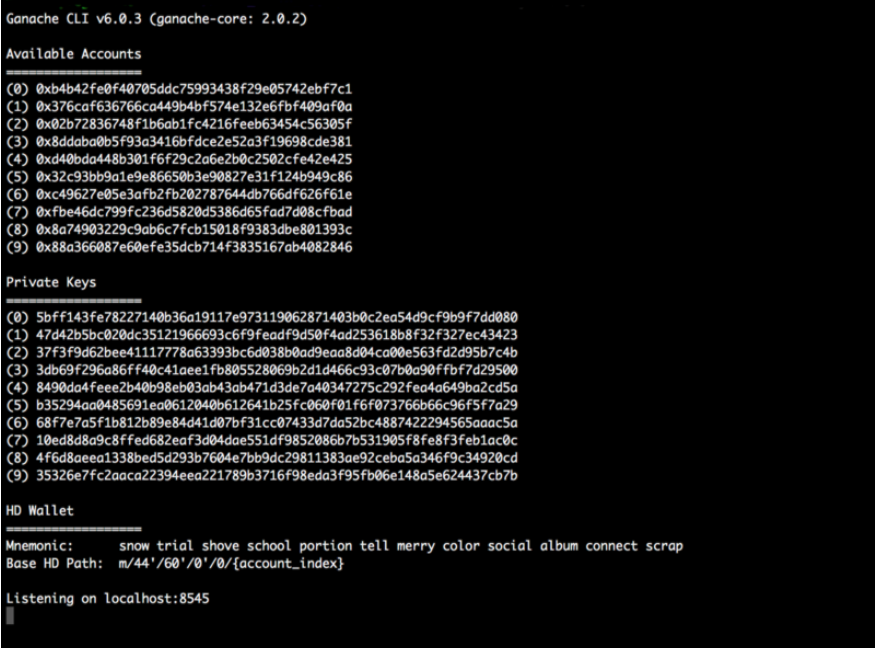

CHAINge
============
A decentralised voting DApp for the Ethereum platform.

VIDEO

## About
This project was built in five days by a team of six during Week 9 of Makers' Academy. The members were [Charles Emery](https://github.com/charlesemery15), [Joe Pike](https://github.com/joepike), [Valentina Romeo](https://github.com/Ciancion), [Nikolaos Sakellarios](https://github.com/lunaticnick), [Cal Widdall](https://github.com/Calum-W) and [Ellie Wintram](https://github.com/ewintram).

At the start of the project, we were familiar with the concept of blockchains, but knew nothing of how they were implemented or the languages used. Our main challenge was learning Solidity (the language used to write the contract), Truffle (Solidity's testing framework), and connecting it to a Javascript-based front-end.

## Tech Stack

Section | Language / Framework
------- | -------------------
Back-end | Solidity, Ganache
Front-end | Javascript / JQuery / Web3
Testing | Truffle

## How To Use

As we had extreme difficulties of connecting to a live Ethereum blockchain (as when we tried to sync with the Testnet/Ropsten blockchain, as per calculations we would need more than 2-3 days to sync and we only had 5 days in our disposal), our project is based on a development environment using ***ganache*** (an in-memory blockchain simulator) and ***web3js*** (a library which lets you interact with the blockchain through RPC).

In order to install ganache, we first need to ensure that we have ***npm*** installed. In order to do this we need to run the following command in our CLI:

```
$ npm -v
```

which would return the version of npm installed on our system.

Then we navigate to the folder where we want to install ***ganache*** and ***web3js*** run the following command in our CLI:
```
$ npm install ganache-cli web3@0.20.2
```

and then we can start the ganache blockchain simulator by executing  again in our CLI the following command:
```
$ node_modules/.bin/ganache-cli
```

This in turn will create the relevant information for 10 test accounts preloaded with 100 fake ethers (please note that every time ganache is restarted these account are generated from scratch).




The next step is to create and deploy the solidity contract that we would like to use wih our application. In order to do this we first install a npm module called solc, which will allow us to compile the code to be deployed to the blockchain. In order to do this we execute:

```
$ npm install solc
```

The next step is to enter the node console and via the console initialize the solc and web3 objects, by issuing the following commands:

```
$ node
```

and create the web3 objects via:

```
> Web3 = require('web3')
> web3 = new Web3(new Web3.providers.HttpProvider("http://localhost:8545"));
```

Now if we issue the following command, we should be able to see all the accounts in the accounts in the blockchain in the form of a array:
```
web3.eth.accounts
```

Then it's time to compile the contract (Voting.sol) via CLI using the following commands:

```
> code = fs.readFileSync('Voting.sol').toString()
> solc = require('solc')
> compiledCode = solc.compile(code)
```

The above sequence loads the code in Voting.sol into a string variable and compiles it. In order to deploy the contract to the blockchain we send the following commands via the node console:
```
> abiDefinition = JSON.parse(compiledCode.contracts[':Voting'].interface)

> VotingContract = web3.eth.contract(abiDefinition)

> byteCode = compiledCode.contracts[':Voting'].bytecode

> deployedContract = VotingContract.new(['Cal','Nick','Joe'],{data: byteCode, from: web3.eth.accounts[0], gas: 4700000})

> deployedContract.address

> contractInstance = VotingContract.at(deployedContract.address)
```

Finally you can interact with the blockchain via two ways:
* Command Line Node Console using the following commands:

```
  CAST A VOTE FOR A SPECIFIC CANDIDATE
        > contractInstance.voteForCandidate('Cal', {from: web3.eth.accounts[0]})

  SEE TOTAL NUMBER OF VOTES FOR A SPECIFIC CANDIDATE
        > contractInstance.totalVotesFor.call('Rama')
```

* Using the web page interface
    In order to use the web interface, need to open index.html and start casting your votes (Please note that in order to enter the voting table, you will need to use one of the test account created by Ganache).


## How to Run the tests

Tests can be run by entering 'truffle test' in the command line.
